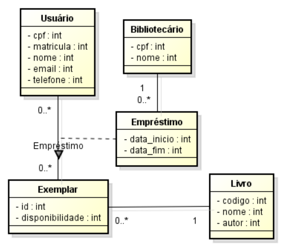

# 🧠 Modelo Conceitual – Classes de Análise

## Descrição das Classes

### Usuário
Pode ser um professor ou aluno. Pode acessar o catálogo de livros, solicitar empréstimos de exemplares e será multado caso não devolva um no prazo.

### Exemplar
Um livro pode ter nenhum, um ou vários exemplares, que são instâncias dele. Um exemplar estará disponível caso nenhum usuário esteja com ele emprestado.

### Livro
Obra literária com título e autor registrados no sistema.

### Empréstimo
Data de início e fim de um empréstimo de um livro específico a um determinado usuário, realizado por um bibliotecário.

### Bibliotecário
Autoriza empréstimos e registra devoluções.

---

## Diagrama de Classes de Análise

